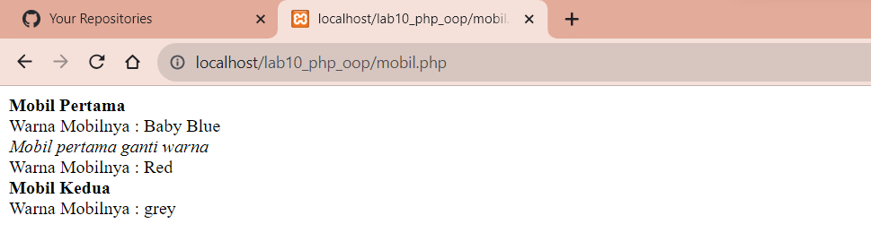
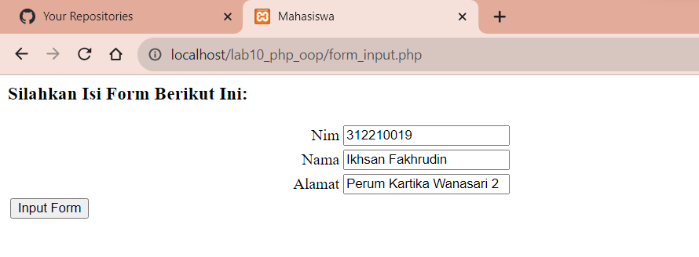

# Tugas Praktikum { Pertemuan ke 12 } 


|**Nama**|**NIM**|**Kelas**|**Matkul**|
|----|---|-----|------|
|Muhammad Ikhsan Fakhrudin|312210019|TI.22.A.2|Pemrograman Web 1|

# PHP OOP

## Langkah-Langkah Praktikum

Membuka ``text editor`` , di sini saya menggunakan ***Visual Studio Code.***


## 1. Menjalankan 'XAMPP Server'

Langkah pertama yang harus dilakukan adalah menjalankan apache dan mysql pada aplikasi Xampp server.

## 2. Membuat 'Folder Baru'

Lalu buatlah folder baru dengan nama ``lab10_php_oop.`` Kemudian jalankan pada localhost dengan mengakses http://localhost/lab10_php_oop/

## 3. Membuat 'File'

Buatlah file baru dengan nama ``mobil.php`` di dalam folder ``lab10_php_oop.`` Lalu buat codingan sebagai berikut dan jalankan pada localhostnya :

http://localhost/lab10_php_oop/mobil.php

```
<?php

/** Program sderhana pendefinisian class dan pemanggilan class. **/

class Mobil
{
    private $warna;
    private $merk;
    private $harga;

    public function __construct()
    {
        $this->warna = "Baby Blue";
        $this->merk = "Gucci";
        $this->harga = "20000000";
    }

    public function gantiWarna ($warnaBaru)
    {
        $this->warna = $warnaBaru;
    }

    public function tampilWarna ()
    {
        echo "Warna Mobilnya : " . $this->warna;
    }
}

# membuat objek mobil

$a = new Mobil();
$b = new Mobil();

# memanggil objek

echo "<b>Mobil Pertama</b><br>";
$a->tampilWarna();
echo "<br><i>Mobil pertama ganti warna</i><br>";
$a->gantiWarna("Red");
$a->tampilWarna();

# memanggil objek

echo "<br><b>Mobil Kedua</b><br>";
$b->gantiWarna("grey");
$b->tampilWarna();

?>
```

***Output :***



## 4. Membuat 'File Form'

Selanjutnya adalah membuat file baru dengan nama ``form.php`` lalu ketik kode program seperti berikut :

```
<?php

/** Nama Class : Form
 * Deskripsi : Class untuk membuat form inputan text sederhana
 */

class Form
{
    private $fields = array();
    private $action;
    private $submit ="Submit Form";
    private $jumField = 0;

    public function __construct($action, $submit)
    {
        $this->action = $action;
        $this->submit = $submit;
    }

    public function displayForm()
    {
        echo "<form action='".$this->action."' method='POST'>";
        echo '<table width="100%" border="0">';
        for ($j=0; $j<count($this->fields); $j++) {
            echo "<tr><td align='right'>".$this->fields[$j]['label']."</td>";
            echo "<td><input type='text' name='".$this->fields[$j]['name']."'></td></tr>";
        }
        echo "<tr><td colspan='2'>";
        echo "<input type='submit' value='".$this->submit."'></td></tr>";
        echo "</table>";
    }

    public function addField($name, $label)
    {
        $this->fields [$this->jumField]['name'] = $name;
        $this->fields [$this->jumField]['label'] = $label;
        $this->jumField ++;
    }
}
?>
```

## 5. Membuat 'Inputan'

Lalu dilanjutkan lagi dengan membuat inputan yang akan tersedia pada ``form.php`` ketik kode program berikut :

Kemudian untuk mengakses direktory tersebut pada web server dengan mengakses URL: http://localhost/lab10_php_oop/form_inputan.php

```
<?php

/** Program Memanfaatkan Program 10.2 untuk membuat form inputan sederhana. */

include "form.php";

echo "<html><head><title>Mahasiswa</title></head></html><body>";
$form = new Form("", "Input Form");
$form->addField("txtnim", "Nim");
$form->addField("txtnama", "Nama");
$form->addField("txtalamat", "Alamat");
echo "<h3>Silahkan Isi Form Berikut Ini: </h3>";
$form->displayForm();
echo "</body></html>";

?>
```

***Output :***




## SELESAI  